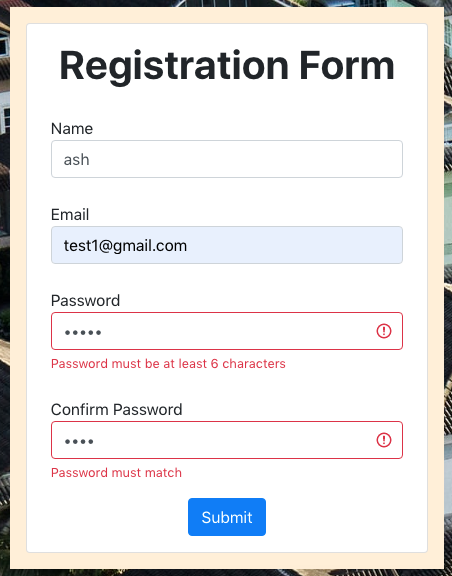
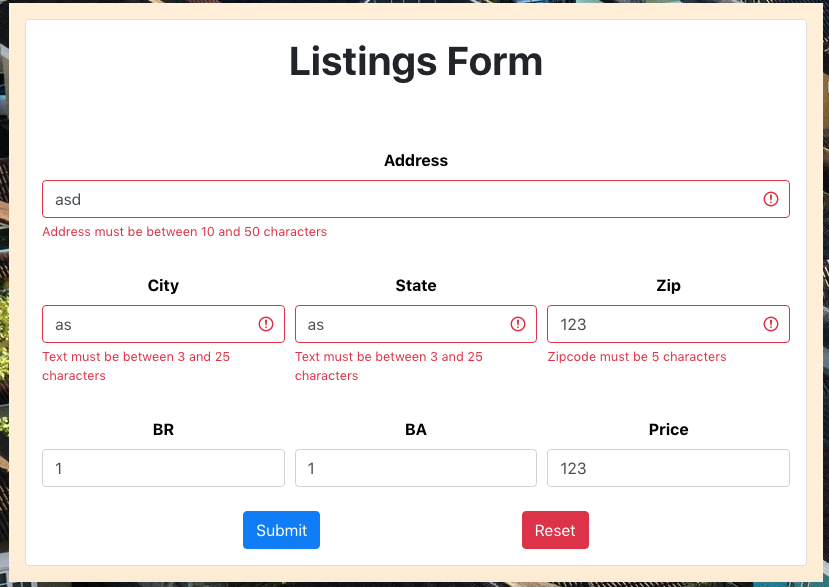

# Property Listing App

### Login + Listing Deletion and Logout Modal Behavior

### Posting and Obtaining Listings

### Validation Samples

## Description:

This mini project is an application that focuses on a small scale version of a Real Estate Multiple Listing Service (MLS) for personal usage. It currently provides a base template that can easily scale based on needs or requirements. 

This project was originally built with having only 1 authenticated user in mind, therefore, listings removal are not limited to associated users.

## Purpose: 

This project was built as a means to tackle user authentication through Passport JSON Web Tokens (JWT) and Bearer tokens, as a previous project using Passport Google Strategy felt a bit clunky and messy. 

In addition, modals and timer based events were a front end feature that was unmet during the previous project, and have successfully been added here.

## Main Features:

- User authentication through Passport JWT linked to its own user schema in MongoDB.
- Extensive error validations for user registration, login, and listing posts.
- Visuals and actions limited to authenticated users:
  - Posting listings, removing listings
- Pop-up modal upon successful logout with a timer that automatically redirects and a button for a manual redirect.
- Any user can see the listings and how many there are. 
  - If there are zero listings available, it will account for that as well.
- Passwords are hashed and salted using bcrypt to aid in security.
- Bearer tokens are set with expiration dates at 30 days.

## Technology:

- Front-End:
  - HTML
  - CSS
  - JS
  - React

- Back-End:
  - Node.js
  - Express
  - MongoDB

- Notable Node Modules | Libraries
  - axios
  - bcrypt
  - bootstrap
  - cookie-parser
  - cors
  - font-awesome related
  - jsonwebtoken
  - jwt-decode
  - mongoose
  - passport
  - passport-jwt
  - react-bootstrap
  - react-router-dom
  - redux
  - redux-thunk
  - styled-components
  - validator